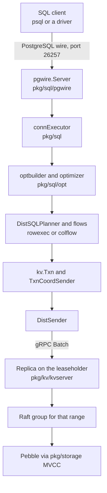
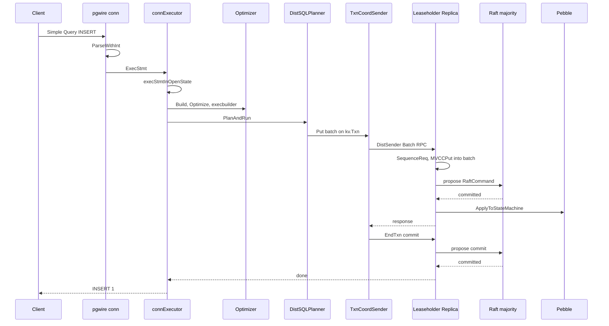
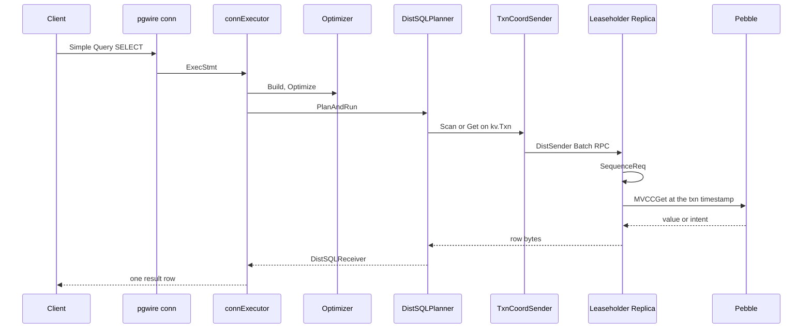
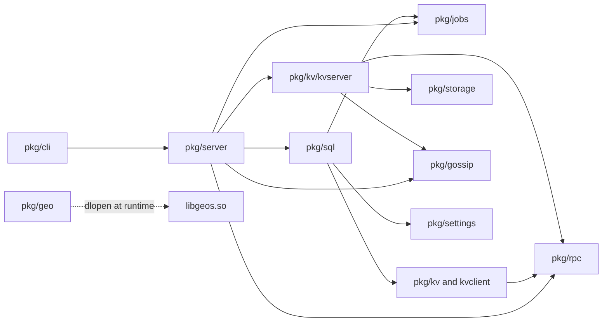

> **FGL page.** Future Gadget Laboratories wrote this for FutureGadgetDatabases.
> It is not a Cockroach Labs document.
>
> Checked against the v23.2.15 tree in this repository. Where an older note in `docs/` disagrees with the code, trust the code and the page that cites it.

# Architecture map

This directory is a map of the open-source tree so later fixes have somewhere to start. The short crash picture for a three-node lab is still [../architecture.md](../architecture.md). This directory is the longer one: how a SQL statement becomes bytes on disk, which package owns which step, and what the CCL-free binary leaves out.

The binary this project ships is `cockroach-oss` (`//pkg/cmd/cockroach-oss:cockroach-oss`), plus `libgeos`. `pkg/ccl` is present in the git tree and is not linked into that binary. See [BOUNDARIES.md](BOUNDARIES.md).

Upstream write-ups that are still worth reading, without copying them here:

- [CockroachDB v23.2 architecture overview](https://www.cockroachlabs.com/docs/v23.2/architecture/overview.html)
- [docs/design.md](../../design.md) — historical design note. It still says RocksDB and a 64 MiB default range. This tree uses Pebble, and the default zone is 128–512 MiB (`zonepb.DefaultZoneConfig` in `pkg/config/zonepb/zone.go`).
- [docs/tech-notes/](../../tech-notes/README.md) and [docs/RFCS/](../../RFCS/README.md)
- Package comments: `pkg/sql/opt/doc.go`, `pkg/keys/doc.go`, `pkg/kv/kvserver/doc.go`

Things this pass could not confirm are in [OPEN-QUESTIONS.md](OPEN-QUESTIONS.md).

## Index

| Page | What it covers |
| --- | --- |
| This file | How one SQL statement moves from the client to disk |
| [sql.md](sql.md) | `pkg/sql`: pgwire, parser, optimizer, DistSQL, schema changer, catalog |
| [kv.md](kv.md) | `pkg/kv`: client, DistSender, transactions, replicas, Raft, allocator, rangefeed |
| [storage.md](storage.md) | `pkg/storage`: Pebble and MVCC |
| [server.md](server.md) | `pkg/server` and `pkg/cli`: startup, HTTP, gRPC, DB Console |
| [jobs.md](jobs.md) | `pkg/jobs` |
| [gossip.md](gossip.md) | `pkg/gossip`, and how it meets liveness and the first range |
| [rpc.md](rpc.md) | `pkg/rpc`, `pkg/security`, and SQL authentication |
| [settings.md](settings.md) | `pkg/settings` and the settings watcher |
| [util.md](util.md) | Notable pieces of `pkg/util`: clock, stopper, log, tracing |
| [geo.md](geo.md) | `pkg/geo` and `c-deps` libgeos |
| [build.md](build.md) | How Bazel, the CCL-free check, and the image fit together |
| [BOUNDARIES.md](BOUNDARIES.md) | What the CCL exclusion removes, and hard limits the code states |
| [OPEN-QUESTIONS.md](OPEN-QUESTIONS.md) | Follow-ups for the test-coverage phase |

## The pieces

A node is one `cockroach-oss` process and its store directory (default path `cockroach-data`, `DefaultStorePath` in `pkg/server/config.go`). Every node can accept SQL. The node you connect to is the **gateway** for that connection. It plans the statement and sends KV batches to the nodes that hold the rows. Those nodes are often not the gateway.

The data is one sorted map of keys. The map is cut into **ranges**. Each range is a Raft group: a few copies of the same key slice, on different stores. The default zone asks for 3 copies, and tries to keep a range between 128 MiB and 512 MiB (`DefaultZoneConfig` in `pkg/config/zonepb/zone.go`). The system ranges (meta, liveness, and the system database) ask for 5 copies (`DefaultSystemZoneConfig`). A 3-node lab cannot meet 5, which is why those ranges look under-replicated until you change the zone. That is already spelled out in [../architecture.md](../architecture.md).

One replica holds the **range lease**. It serves reads and proposes writes. Raft then has to agree. The leaseholder and the Raft leader are usually the same process, but the code treats them as different jobs. `Replica.maybeTransferRaftLeadershipToLeaseholderLocked` in `pkg/kv/kvserver/replica.go` tries to put the leader on the leaseholder. A learner replica cannot hold the lease or the leadership (`replicateQueue.shedLease` in `pkg/kv/kvserver/replicate_queue.go`).



Gossip, liveness, the jobs registry, and the settings watcher sit beside this path. They do not run inside a user statement, but a statement stalls when they are wrong: a dead leaseholder, a missing range descriptor, or a schema change job that has not finished.

## How a statement moves

Take this session, typed in `psql` against port 26257:

```sql
CREATE TABLE sensors (id INT PRIMARY KEY, reading FLOAT);
INSERT INTO sensors VALUES (1, 20.5);
SELECT reading FROM sensors WHERE id = 1;
```

`CREATE TABLE` is a schema change. The other two are the path below. Implicit transactions are the default: each statement is its own transaction unless you sent `BEGIN`.

### 1. The wire

`pgwire.Server.ServeConn` (`pkg/sql/pgwire/server.go`) accepts the TCP connection. After authentication (`conn.handleAuthentication`), `conn.processCommands` (`pkg/sql/pgwire/conn.go`) calls `sql.Server.ServeConn` (`pkg/sql/conn_executor.go`), which runs `connExecutor.run`.

A simple query (`Query` message, what `psql` sends for a one-line statement) is parsed in `conn.handleSimpleQuery` with `parser.ParseWithInt`. Each statement becomes an `ExecStmt` on a `StmtBuf`. The extended protocol (`Parse` / `Bind` / `Execute`, what most drivers use for prepared statements) parses once in `conn.handleParse` and later pushes `ExecPortal`.

The parser itself is `pkg/sql/parser`. `parser.Parse` drives the yacc parser generated from `sql.y` and returns `statements.Statements`, each holding a `tree.Statement` AST.

### 2. The connection executor

`connExecutor.execCmd` pulls one command. `execStmt` looks at the transaction state machine in `pkg/sql/conn_fsm.go`:

| State | Meaning |
| --- | --- |
| `stateNoTxn` | No SQL transaction yet. Most statements only start one (`eventTxnStart`) and run again in `stateOpen`. |
| `stateOpen` | The statement actually runs. |
| `stateAborted` | The transaction saw an error. You need `ROLLBACK`, or `ROLLBACK TO SAVEPOINT`. |
| `stateCommitWait` | The transaction has committed; the executor is still finishing the client protocol. |

`execStmtInOpenState` (`pkg/sql/conn_executor_exec.go`) is the open-state body. A query error is written to the client result. It does not, by itself, tear down the connection.

The SQL transaction's KV handle is `txnState.mu.txn`, a `*kv.Txn`, created in `resetForNewSQLTxn`. `COMMIT` calls `Txn.Commit`. That sends an `EndTxn` request.

### 3. Planning

`dispatchToExecutionEngine` calls `makeExecPlan` → `planner.makeOptimizerPlan` (`pkg/sql/plan_opt.go`).

1. `optbuilder.Builder.Build` (`pkg/sql/opt/optbuilder/builder.go`) resolves names, type-checks, and fills a **memo** (`memo.Memo` in `pkg/sql/opt/memo`). The memo is a set of equivalent expressions for the same query, not a single chosen plan.
2. `xform.Optimizer.Optimize` (`pkg/sql/opt/xform/optimizer.go`) picks the cheapest physical expression. The comment says it cannot be run twice on the same memo.
3. `execbuilder.Builder.Build` (`pkg/sql/opt/exec/execbuilder/builder.go`) turns that expression into something the executor can run.

With the v23.2.15 defaults, `sql.defaults.experimental_distsql_planning` is `off` (`exec_util.go`), so the usual path is the exec factory and then `DistSQLPlanner.createPhysPlan` (`pkg/sql/distsql_physical_planner.go`), which builds a `physicalplan.PhysicalPlan`. `GenerateFlowSpecs` (`pkg/sql/physicalplan/physical_plan.go`) produces one `FlowSpec` per SQL instance that will run part of the plan.

`sql.defaults.distsql` defaults to `auto`. A single-range point lookup often stays on the gateway. A plan that reads many ranges can put processors on other nodes.

`sql.defaults.vectorize` defaults to `on`. While setting up flows, `DistSQLPlanner` calls `colflow.IsSupported` (`pkg/sql/colflow/vectorized_flow.go`). If every processor in the spec has a columnar implementation, the flow runs in the vectorized engine (`pkg/sql/colexec`, `pkg/sql/colflow`). Otherwise it falls back to row processors in `pkg/sql/rowexec`. `vectorize=experimental_always` errors instead of falling back.

### 4. Execution to KV

`DistSQLPlanner.PlanAndRunAll` (`pkg/sql/distsql_running.go`) runs subqueries, the main plan, and cascades or foreign-key checks. `Run` calls `GenerateFlowSpecs`, starts a local flow with `SetupLocalSyncFlow`, and sends remote flows over DistSQL RPCs.

Row reads go through `pkg/sql/row`. `txnKVFetcher` sends a `BatchRequest` on the SQL transaction's `kv.Txn` (`pkg/sql/row/kv_batch_fetcher.go`). Inserts build similar batches of `Put`s (and sometimes conditional puts) through the row writer.

Catalog reads (the `sensors` table descriptor) go through `descs.Collection` (`pkg/sql/catalog/descs`). A leased descriptor is cached and valid only for a time window. `lease.Manager` (`pkg/sql/catalog/lease`) owns that. The executor calls `MaybeUpdateDeadline` so the transaction cannot read at a timestamp past the lease.

### 5. KV client

`kv.Txn.Send` reaches `TxnCoordSender.Send` (`pkg/kv/kvclient/kvcoord/txn_coord_sender.go`). For a root transaction the interceptor stack, top to bottom, is:

1. `txnHeartbeater` — keeps the transaction record alive (about once a second; see `DefaultTxnHeartbeatInterval` in `pkg/base/constants.go`).
2. `txnSeqNumAllocator` — sequence numbers so a retried batch is not applied twice.
3. `txnPipeliner` — can pipeline writes and track in-flight intents.
4. `txnCommitter` — attaches `EndTxn`, and can commit a single-range transaction in one round trip (1PC) or use a parallel commit.
5. `txnSpanRefresher` — tries to refresh read spans instead of restarting the whole transaction.
6. `txnMetricRecorder`
7. `txnLockGatekeeper` — releases the sender lock before the RPC, then calls `DistSender`.

`DistSender.Send` (`pkg/kv/kvclient/kvcoord/dist_sender.go`) looks up which range owns the key. The cache is `rangecache.RangeCache`. A miss scans the meta2 range, and if needed meta1, for a `RangeDescriptor` (`pkg/keys`, `keys.RangeMetaKey`). If the batch spans ranges, `divideAndSendBatchToRanges` splits it. Splitting turns off the one-phase commit shortcut.

`grpcTransport.SendNext` (`pkg/kv/kvclient/kvcoord/transport.go`) prefers the cached leaseholder and calls the node's `Batch` RPC.

### 6. Replica, Raft, disk

`Replica.Send` (`pkg/kv/kvserver/replica_send.go`) acquires a concurrency guard: `concMgr.SequenceReq` (`pkg/kv/kvserver/concurrency`). That takes latches and waits on the lock table so two requests do not overlap on the same keys in a way the isolation level forbids.

A read is evaluated against MVCC and returns. A write takes `executeWriteBatch` (`pkg/kv/kvserver/replica_write.go`) → `evalAndPropose` → `evaluateProposal` (`pkg/kv/kvserver/replica_proposal.go`). Evaluation uses `batcheval` and `storage.MVCCPut` / `MVCCGet`, writing into an in-memory batch. The result is a `RaftCommand` (the batch plus a `ReplicatedEvalResult`). `Replica.propose` (`pkg/kv/kvserver/replica_raft.go`) encodes it and inserts it into the proposal buffer.

`handleRaftReady` appends the log (`pkg/kv/kvserver/logstore`), sends Raft messages, and applies committed entries (`apply.Task.ApplyCommittedEntries` in `pkg/kv/kvserver/apply/task.go`). `replicaAppBatch.ApplyToStateMachine` (`pkg/kv/kvserver/replica_app_batch.go`) commits that batch to Pebble. The write is committed for the range when a majority of replicas have the log entry. With 3 replicas, that is 2.

A transactional `Put` is an **intent**: a provisional value tied to the transaction id. Other readers at or above that timestamp have to wait, push, or see a lock conflict. `EndTxn` marks the transaction committed. Intent cleanup is often asynchronous (`Store.intentResolver`).

The pictures for a one-row `INSERT` and `SELECT` are below. The Raft write path, in more detail, is in [kv.md](kv.md).



A single-range implicit transaction can fold the `EndTxn` into the same batch (the committer's one-phase commit). The diagram shows the two-step shape, which is what you see once the writes touch more than one range.



A committed read does not append a Raft log entry. It still has to talk to the leaseholder, not to an arbitrary replica. Follower reads (`with_min_timestamp`, `with_max_staleness`) are a CCL hook; on this binary they return a CCL-required error. See [BOUNDARIES.md](BOUNDARIES.md).

### 7. What else has to be true

None of the steps above find a peer by themselves.

- **Startup.** `cli.start` → `server.NewServer` → `PreStart` → `AcceptClients`. Listeners come up before the node serves SQL. Detail in [server.md](server.md).
- **Gossip.** Nodes exchange addresses, store descriptors, liveness, and the first range descriptor (`pkg/gossip`). The first range's leaseholder gossips the sentinel (`KeySentinel`) and `KeyFirstRangeDescriptor`.
- **Liveness.** `pkg/kv/kvserver/liveness` heartbeats a liveness record. The allocator will not place a new replica on a node that looks dead.
- **Meta ranges.** Range descriptors live in meta1 and meta2, which are themselves ranges. `DistSender` caches them. After a split, a stale cache entry causes a retry.
- **Rebalancing.** `replicateQueue` and `StoreRebalancer` (`pkg/kv/kvserver`) call `allocatorimpl.Allocator` to add, remove, or move replicas and to transfer leases.
- **Jobs and schema changes.** `CREATE TABLE` and later `ALTER`s either run the declarative schema changer (`pkg/sql/schemachanger`, job type `NEW_SCHEMA_CHANGE`) or the legacy mutation changer (`pkg/sql/schema_changer.go`, job type `SCHEMA_CHANGE`). The cluster default `sql.defaults.use_declarative_schema_changer` is `on`. In that mode the declarative changer runs for a single implicit statement (`TxnIsSingleStmt`, set from `canAutoCommit` in `conn_executor_exec.go`). An explicit transaction, including one with only one statement, takes the legacy path: `planner.SchemaChange` returns `nil, nil`. Either way, `jobs.Registry` adopts the job on some node after the creating transaction commits.

## Package dependencies

This is the compile-time shape a reader needs, not every import. Arrows mean "this package calls into that one on the request path."



`pkg/ccl` is not on this graph. `//pkg/cmd/cockroach-oss` depends on `//pkg/cli` and `//pkg/ui/distoss` only (`pkg/cmd/cockroach-oss/BUILD.bazel`). The full `//pkg/cmd/cockroach` binary blank-imports `pkg/ccl` from its `main.go`. This project does not build that target for release. The build diagram is in [build.md](build.md).
