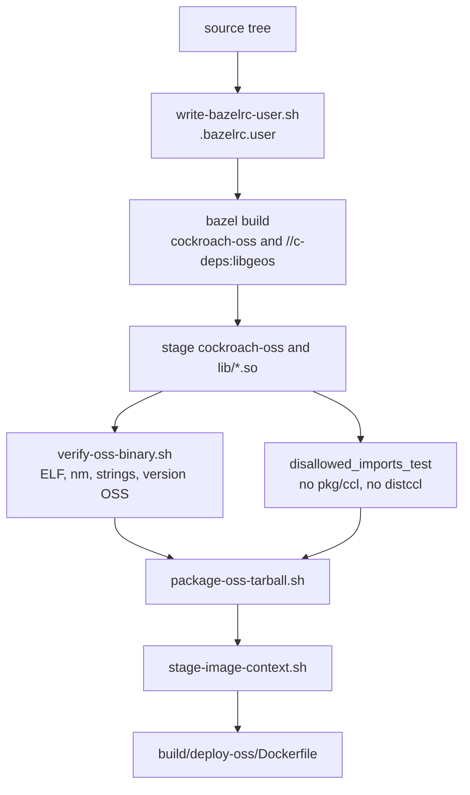

> **FGL page.** Future Gadget Laboratories wrote this for FutureGadgetDatabases.
> It is not a Cockroach Labs document.

# How the OSS binary is built

The released artifact is two things: the `cockroach-oss` binary, and `libgeos.so` / `libgeos_c.so`. The image is those files plus `build/deploy/cockroach.sh` on a Red Hat UBI 9 minimal base. This page is the path in this repository. It does not describe the machine that runs the compile.

Scripts:

| Script | Role |
| --- | --- |
| `build/fgdb/write-bazelrc-user.sh` | Writes a gitignored `.bazelrc.user`. |
| `build/fgdb/build-oss.sh` | `bazel build` of the two targets, then stages the outputs. |
| `build/fgdb/verify-oss-binary.sh` | Refuses a binary that looks like CCL. |
| `build/fgdb/package-oss-tarball.sh` | Tarball plus `SHA256SUMS`. |
| `build/fgdb/stage-image-context.sh` | Unpacks the tarball into a Docker context. |
| `build/fgdb/resolve-image-digest.sh` | Reads the image digest from the registry after `docker push`. |
| `build/deploy-oss/Dockerfile` | The image. |
| `.github/workflows/fgdb-oss-release.yml` | Runs the scripts above. A tag push `v*-oss`, or a manual run with publish enabled, also uploads the release and the image. |

`./dev build oss` is the workstation wrapper documented in [../getting-started.md](../getting-started.md). The release script does not call `./dev`. The comment in `build-oss.sh` says `./dev` on a clean tree wants `dev doctor`, and that command rewrites `.bazelrc.user`.

## Bazel

`write-bazelrc-user.sh` emits, among other lines:

- `--config=ci` and `--config=nolintonbuild`
- `--//build/toolchains:nogo_disable_flag` (the comment says this turns the nogo analyzers off for the release build)
- `--config=crosslinuxbase` and `-c opt`
- a quoted `--workspace_status_command=./build/bazelutil/stamp.sh <triple> <channel> release`

The default triple is `x86_64-pc-linux-gnu`. The default channel is `fgl-oss`. `verify-oss-binary.sh` checks that `cockroach-oss version` says `Build Type: release` and `Go Version:` containing `go1.21.12` (override with `FGDB_EXPECT_GO`). The channel is stamped into the binary. It is not `official-binary`.

`build-oss.sh` then runs exactly:

```text
bazel build //pkg/cmd/cockroach-oss:cockroach-oss //c-deps:libgeos
```

It does not build `//pkg/cmd/cockroach`. `.bazelrc` sets `--symlink_prefix=_bazel/`, so the binary is read from `_bazel/bin/pkg/cmd/cockroach-oss/cockroach-oss_/cockroach-oss` and copied to `./cockroach-oss`.

### What `cockroach-oss` links

`pkg/cmd/cockroach-oss/BUILD.bazel`:

- `go_binary` name `cockroach-oss`
- library deps: `//pkg/cli`, `//pkg/ui/distoss`
- `disallowed_imports_test` with prefixes `pkg/ccl` and `pkg/ui/distccl`

`//pkg/ui/distoss` embeds a tar of the OSS DB Console (`pkg/ui/distoss/distoss.go`, `//go:embed assets.tar.gz`). Building the binary builds the UI. There is no separate webpack step in this script.

`pkg/build/info.go` sets `Distribution = "OSS"`. A CCL init hook is what changes that string in the other binary. Nothing in `cockroach-oss`'s `main` does.

### libgeos

`//c-deps:libgeos` is an alias (`cdep_alias` in `c-deps/archived.bzl`):

- linux/amd64 without `force_build_cdeps` → `:archived_cdep_libgeos_linux` (a prebuilt archive)
- `force_build_cdeps`, or an OS the alias does not list → `:libgeos_foreign` (CMake of `@geos`, in `c-deps/BUILD.bazel`)

The release `.bazelrc.user` does not enable `force_build_cdeps`. `build-oss.sh` copies `libgeos.so` and `libgeos_c.so` out of `external/archived_cdep_libgeos_linux/lib` (or the matching path under the execution root). If those files are missing it stops. The Go code `dlopen`s them later (`pkg/geo/geos`). They are not inside the `cockroach-oss` binary.

## The CCL-free check

Two checks, and they look at different things.

**1. Import graph.** `bazel test //pkg/cmd/cockroach-oss:cockroach-oss_disallowed_imports_test` fails if the `cockroach-oss` target's transitive imports include `pkg/ccl` or `pkg/ui/distccl`. This is the rule in `pkg/cmd/cockroach-oss/BUILD.bazel`. It does not open the finished binary.

**2. The file that will be packaged.** `verify-oss-binary.sh` requires:

- a 64-bit x86-64 ELF
- `nm -a` does not match `cockroach/pkg/ccl/` or `cockroach/pkg/ui/distccl`
- `strings -a` does not contain `github.com/cockroachdb/cockroach/pkg/ccl/` or `.../pkg/ui/distccl`
- `version` output has a `Distribution:` line containing `OSS` and not `CCL`
- `Build Type:` contains `release`
- `Go Version:` contains the expected Go string

`pkg/ccl` staying in the git tree is fine. The check is about the binary. [../license.md](../license.md) says the same thing.

## Tarball and image

`package-oss-tarball.sh` reads `pkg/build/version.txt` (must look like `vX.Y.Z`). It builds a directory named `cockroach-oss-<version>.linux-amd64/` containing:

- `cockroach` — the `cockroach-oss` binary, renamed so the archive matches the usual CockroachDB layout
- `lib/libgeos.so`, `lib/libgeos_c.so`
- `LICENSE`, `licenses/`, and `OSS-BUILD.txt`

`OSS-BUILD.txt` says `licenses/CCL.txt` is license text from the source tree, not a grant of CCL code, and that no CCL object code is in the binary. The script writes `SHA256SUMS` and `build-info.env` (`VERSION`, `TARBALL`, `RELEASE_TAG=<version>-oss`).

`stage-image-context.sh` unpacks that tarball and adds `build/deploy/cockroach.sh` as the entrypoint. The context is:

```text
cockroach.sh
cockroach
libgeos.so
libgeos_c.so
licenses/
```

`build/deploy-oss/Dockerfile` copies `cockroach` and `cockroach.sh` to `/cockroach/`, the libraries to `/usr/local/lib/cockroach/`, and the licenses to `/licenses/`. It sets `COCKROACH_CHANNEL=fgl-oss`, exposes `26257` and `8080`, and uses `ENTRYPOINT ["/cockroach/cockroach.sh"]`. The base image is pinned by digest (UBI 9 minimal). The comment in the Dockerfile says the process runs as root, matching the upstream image layout, because charts expect `/cockroach/cockroach-data` to be root-owned. `fips_enabled` defaults to 0.

The workflow's publish path tags the image as `<version>-oss`, `sha-<commit>`, and, unless turned off, the moving `<major>.<minor>-oss` alias. `docker push` does not have to print a `digest:` line. `build/fgdb/resolve-image-digest.sh` asks the registry (`docker buildx imagetools inspect`) and checks that every tag resolves to the same `sha256`. A later job writes that digest into the GitHub release notes. Pin the digest. The minor alias moves.



## Gotchas

- **`./dev build` with no target builds `//pkg/cmd/cockroach`.** That binary blank-imports `pkg/ccl`. [../license.md](../license.md) says not to ship it. `build-oss.sh` deletes a staged file named `cockroach` in the source tree so it cannot be picked up by mistake. The tarball's `cockroach` is a renamed `cockroach-oss`, created later by the packaging script.
- **`strings` and `nm` are required.** `verify-oss-binary.sh` exits if binutils is missing. A green Bazel build is not the check that the workflow publishes.
- **The UI bundle is inside the Go binary.** You do not copy `pkg/ui/distoss` into the image separately. `distccl` must not be in the binary. The console will simply lack the CCL screens.
- **libgeos is easy to forget** because Bazel does not link it into `cockroach-oss`. A container that copies only the binary will start, and the first spatial function will return `geos: this operation is not available` ([geo.md](geo.md)).
- **`crosslinuxbase` is the public crosstool config.** The comment in `write-bazelrc-user.sh` says not to use `./dev build --cross`, which uses a different builder image. The release path stays on `crosslinuxbase`.
