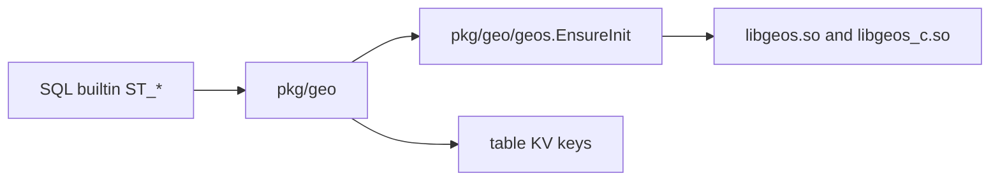

> **FGL page.** Future Gadget Laboratories wrote this for FutureGadgetDatabases.
> It is not a Cockroach Labs document.

# pkg/geo and libgeos

Spatial SQL (`GEOMETRY`, `GEOGRAPHY`, and the functions behind them) lives in `pkg/geo`. The heavy geometry is not implemented in Go. It is the GEOS C library, loaded at runtime as `libgeos.so` and `libgeos_c.so`. The release image copies those two files to `/usr/local/lib/cockroach/`. The `cockroach-oss` binary does not link them statically.

This is OSS code. A search of `pkg/geo` found no CCL-required error. Enterprise features that people sometimes lump in with "geo" (multi-region, partitioning) are different packages. See [BOUNDARIES.md](BOUNDARIES.md).

## Purpose

- Represent spatial values and encode them (EWKB) in `pkg/geo`.
- Call GEOS for predicates and constructors (`ST_Intersects`, buffers, and the rest) through `pkg/geo/geos`.
- Index them with the geo index helpers under `pkg/geo/geoindex`. The index entries are still ordinary KV keys. The SQL layer writes them. GEOS does not store rows.

## Key types and entry points

| Piece | Where | Role |
| --- | --- | --- |
| Package `geo` | `pkg/geo/geo.go` | Spatial types and encoding. |
| `geos.EnsureInit` | `pkg/geo/geos/geos.go` | Loads GEOS once. Returns the directory it found, or an error. |
| `initGEOS` | `pkg/geo/geos/geos.go` | Calls `C.CR_GEOS_Init` with the paths of `libgeos_c` and `libgeos`. |
| `findLibraryDirectories` | `pkg/geo/geos/geos.go` | Bazel runfiles (`c-deps/libgeos_foreign/lib`, `external/archived_cdep_libgeos_*`) and paths next to the binary. |
| Public failure | `ensureInit` in the same file | If the library is missing and the caller asked for a public error: `geos: this operation is not available` (`pgcode.System`). |
| C wrapper | `pkg/geo/geos` (`geos.h`, cgo) | `#cgo LDFLAGS: -ldl -lm` on non-Windows. The dynamic loader is `dlopen`, via that wrapper. |
| Bazel alias | `//c-deps:libgeos` | `cdep_alias("libgeos")` in `c-deps/BUILD.bazel`. |
| From-source target | `libgeos_foreign` in `c-deps/BUILD.bazel` | CMake build of `@geos`. The install script in that rule copies `libgeos.so.3.11.2` to `libgeos.so`. |
| Prebuilt alias | `c-deps/archived.bzl` | `cdep_alias` points linux/amd64 with c-deps not forced at `:archived_cdep_libgeos_linux`. |

`pkg/geo/geos/BUILD.bazel` data-depends on `//c-deps:libgeos` for tests. The `cockroach-oss` `go_binary` does not. Shipping the `.so` files is the job of `build/fgdb/build-oss.sh` and the image Dockerfile. See [build.md](build.md).

## How data and control enter and leave

**In.** A SQL expression calls a builtin. The builtin calls into `pkg/geo` or `pkg/geo/geomfn` / `geogfn`. The first GEOS call runs `EnsureInit`, which `dlopen`s the two libraries and keeps the handle for the process lifetime (`sync.Once` in `ensureInit`).

**Out.** A Go value (a geometry, a bool, a float). Nothing is written to a special geo store. If the value is a column, the SQL row writer encodes it into the table's KV entries like any other column. A spatial index adds more keys. Those keys go through the normal [kv.md](kv.md) path.

## What it depends on

- GEOS 3.11-line shared libraries. The from-source rule names `libgeos.so.3.11.2`. The release build does not compile that rule. It copies the prebuilt archive `archived_cdep_libgeos_linux` (see `build/fgdb/build-oss.sh`). `write-bazelrc-user.sh` tells the operator not to pass `--config=force_build_cdeps` unless the host toolchain matches the v23.2.15 c-dep build.
- `cgo` and `libdl`.
- `pkg/geo/geopb` for the protobuf form of a spatial value.
- The SQL catalog and `pkg/sql/sem` builtins, which call in. `pkg/geo` does not import `pkg/kv/kvserver`.

## Invariants

- Both libraries have to match. `libgeos_c.so` is loaded with an rpath of `/usr/local/lib/cockroach/` in the from-source Linux install script (`patchelf` in `c-deps/BUILD.bazel`). The image puts both files in that directory. Splitting them across directories breaks the load.
- `EnsureInit` runs once. A failure is sticky for the process. Copying the libraries into place later does not retry unless the process restarts.
- Missing GEOS is a statement error, not a node crash. The public string is `geos: this operation is not available`.

## Gotchas

- **The binary starts without libgeos.** `cockroach-oss version` works. The first `ST_Intersects` (or whichever builtin initializes GEOS) fails. The tarball and the image both ship the libraries. A hand-copied binary without `lib/` does not.
- **`//c-deps:libgeos` is an alias, not one rule.** On the release config (linux/amd64, `force_build_cdeps` off) it is the archived prebuilt. On any other select branch, including `force_build_cdeps`, it is `libgeos_foreign`, the CMake build. `build-oss.sh` looks only for the prebuilt tree and exits if it is absent.
- **Bazel runfiles versus the installed layout.** `findLibraryDirectories` knows about `external/archived_cdep_libgeos_linux/lib` for tests and `bazel run`. A packaged binary looks next to itself and in the library path. Both are in `geos.go`. If you are debugging "works under bazel test, fails in the tarball," you are in this function.
- **Windows has no archived libgeos** (`archived.bzl` says so). This project's release scripts are linux/amd64 only.
- **Do not confuse this with CCL "geo-partitioning."** Partitioning is `CreatePartitioningCCL` in `pkg/sql/create_table.go` and returns `creating or manipulating partitions requires a CCL binary`. You can store a `GEOMETRY` column and still be unable to `PARTITION BY` that table.
