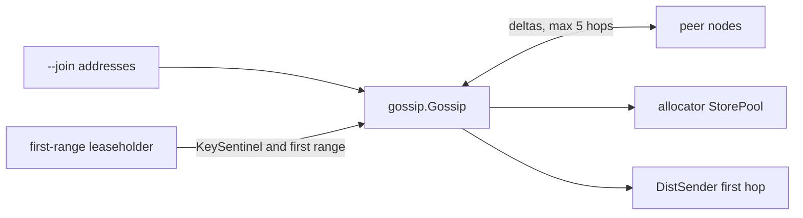

> **FGL page.** Future Gadget Laboratories wrote this for FutureGadgetDatabases.
> It is not a Cockroach Labs document.

# pkg/gossip

Gossip is how a node learns who else is alive and where the first range is, without a separate metadata service. It is an epidemic protocol: each node talks to a few peers and exchanges deltas until a sentinel says "you are in the cluster."

The algorithm comment at the top of `pkg/gossip/gossip.go` is the one to read. This page is the keys and the call sites.

## Purpose

- Spread node descriptors, store descriptors, and liveness info.
- Spread the first range descriptor, so a new node can find meta1 and then the rest of the keyspace.
- Notice a partition: if the sentinel is missing or expired, the node treats itself as disconnected and bootstraps again.

Gossip is not the Raft log and it is not a source of truth for user data. A value you needed to be durable belongs in a range. Gossip is a hint that can expire.

## Key types and entry points

| Piece | Where | Role |
| --- | --- | --- |
| `Gossip` | `pkg/gossip/gossip.go` | Clients, server, `infoStore`, bootstrap addresses, cached node and store descriptors. |
| `Gossip.Start` | `pkg/gossip/gossip.go` | Starts the RPC server, the bootstrap client, and the connection manager. Called from `Server.PreStart`. |
| `AddInfo` / `AddInfoProto` | `pkg/gossip/gossip.go` | Local publish. `Connected` closes when the cluster id / sentinel has been seen. |
| `server.Gossip` | `pkg/gossip/server.go` | The stream: merge the remote delta, reply with the local delta and high-water stamps. |
| Keys | `pkg/gossip/keys.go` | What the info keys mean. |
| First range | `pkg/kv/kvserver/replica_gossip.go` | Leaseholder of the first range gossips the sentinel and the descriptor. |
| Periodic task | `pkg/kv/kvserver/store_gossip.go` | `maybeGossipFirstRange`, node liveness span, store descriptor (`StoreGossip`). |
| `maxHops` | `pkg/gossip/gossip.go` | Constant `5`. Info that arrives from farther away makes the node pick a closer peer. |

### Keys, from `pkg/gossip/keys.go`

| Constant | Payload |
| --- | --- |
| `KeyClusterID` | Cluster UUID. `Gossip.Connected` waits on this. |
| `KeyNodeDescPrefix` | `roachpb.NodeDescriptor` (address, locality, attributes). |
| `KeyStoreDescPrefix` | `roachpb.StoreDescriptor` (capacity, range count). The allocator reads these. |
| `KeyNodeLivenessPrefix` | Liveness info for each node. |
| `KeySentinel` | Gossiped by the first range leaseholder. Used to detect a partition. |
| `KeyFirstRangeDescriptor` | Descriptor for the first range, so a node can route meta lookups before its range cache is warm. |
| `KeyDeprecatedSystemConfig` | The old full system-config blob. The comment says it is unused from 22.1 on. This pin is 23.2. Do not build new code on it. |

TTLs for node and store info are constants in `gossip.go` (`NodeDescriptorTTL`, `StoreTTL`). Expired info is dropped. A node that stops gossiping disappears from peers even if the process is technically still up.

## How data and control enter and leave

**In.** `Server.PreStart` calls `gossip.Start` with the advertised address and the join list (`--join`, or the single node talking to itself). `Node.start` (`pkg/server/node.go`) then gossips this node's descriptor.

**Steady state.** Each store periodically gossips its descriptor (`store_gossip.go`). The first range's leaseholder gossips `KeySentinel` (the cluster id bytes) and `KeyFirstRangeDescriptor` (`replica_gossip.go`). Liveness heartbeats update `KeyNodeLivenessPrefix`.

**Out.** Consumers register callbacks:

- The store pool (allocator) watches store descriptors.
- DistSender's first contact uses the gossiped first range, then the range cache.
- `Node` watches liveness.

When the sentinel is absent, `Gossip.Connected` is not closed, or it is considered expired and the node goes back to bootstrapping (step 1 in the `gossip.go` comment). That looks, from SQL, like the node is up but not taking work.

## What it depends on

- `pkg/rpc` for the gossip stream. No RPC, no gossip.
- The first range, which is a normal Raft range. Gossip does not invent the descriptor; the leaseholder reads it and publishes it.
- `pkg/roachpb` descriptor protos.
- `pkg/util/stop` for shutdown.

It does not depend on SQL. Gossip starts before `sqlServer.preStart`.

## Invariants

- The sentinel is gossiped by the leaseholder of the first range, not by every node. If that range has no quorum, sentinel gossip stops, and other nodes will decide they are partitioned even if their disks are fine.
- Info has a TTL. Gossip is a cache of "what did someone claim recently."
- `maxHops` is 5. A node does not keep a peer that only offers distant info when it can dial something closer.
- Node descriptors and store descriptors are separate. The allocator places replicas on stores, not on "nodes" in the abstract.

## Gotchas

- **A network partition and a dead node look different.** A dead node's liveness expires and the allocator replaces replicas, if a quorum of each range remains. A partition can make a live node look disconnected because the sentinel cannot reach it. Do not decommission a node just because gossip is quiet. Check `cockroach node status` (`is_live`) and whether the ranges still have a quorum.
- **`KeyDeprecatedSystemConfig` is a trap.** Older blog posts say "zone configs are gossiped as the system config." On 23.2, span configs are stored and watched as data. The gossip key remains so a mixed-version story from 21.2 had a name. New code that writes it will not move zone configs.
- **Single-node lab.** The node bootstraps gossip against its own address. The sentinel still has to be gossiped by the first range, which has one replica. That works. It does not exercise partition detection.
- **Join address is only a bootstrap list.** After the node has descriptors, it dials peers it learned. A stale `--join` host that is no longer a member is a slow start, not a permanent dependency, as long as some listed address reaches a live member.
