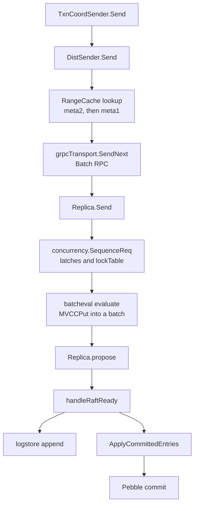

> **FGL page.** Future Gadget Laboratories wrote this for FutureGadgetDatabases.
> It is not a Cockroach Labs document.

# pkg/kv

`pkg/kv` is the sorted map the SQL layer calls. The client half turns a batch into RPCs. The server half (`pkg/kv/kvserver`) is one store: many ranges, each with its own Raft group, writing MVCC keys into Pebble. The package comment in `pkg/kv/kvserver/doc.go` is the short version of that. `pkg/kv/doc.go` says the KV API is not the supported external interface. SQL is.

## Purpose

- Give SQL a transactional client: `DB`, `Txn`, heartbeats, retries, intent cleanup.
- Route each key to the range that owns it (`DistSender`, meta ranges, range cache).
- On the store, sequence requests, evaluate them, replicate writes with Raft, and apply them to the engine.
- Repair placement: split, merge, replicate, rebalance, transfer leases.
- Stream changes to a key span (rangefeed). SQL uses this for the settings watcher and for changefeed-shaped features. The changefeed SQL statement itself is CCL. The rangefeed machinery is not.

## Layout

| Path | What lives there |
| --- | --- |
| `pkg/kv/db.go`, `txn.go`, `sender.go`, `batch.go` | `DB`, `Txn`, `Sender`, `TxnSender`. |
| `pkg/kv/kvclient/kvcoord/` | `DistSender`, `TxnCoordSender`, gRPC transport, txn interceptors (`txn_interceptor_*.go`). |
| `pkg/kv/kvclient/rangecache/` | Range descriptor and lease cache. |
| `pkg/kv/kvclient/rangefeed/` | Client rangefeed over DistSender. |
| `pkg/kv/kvserver/` | `Store`, `Replica`, queues, Raft apply path. |
| `pkg/kv/kvserver/batcheval/` | Per-request evaluation (`Get`, `Put`, `EndTxn`, `Scan`, …). |
| `pkg/kv/kvserver/concurrency/` | Latches and the lock table. |
| `pkg/kv/kvserver/apply/`, `logstore/`, `raftlog/` | Apply committed entries; persist the Raft log. |
| `pkg/kv/kvserver/allocator/` | Where replicas and leases should sit. |
| `pkg/kv/kvserver/rangefeed/` | Per-range change stream (`Processor`, `Registry`). |
| `pkg/kv/kvserver/liveness/` | Node liveness records. |
| `pkg/kv/kvpb/` | The `BatchRequest` protobuf API. |
| `pkg/keys/` | Key encoding, meta1/meta2, range-local keys. Not under `pkg/kv`, but DistSender cannot be read without it. |

`sender.go` lists the types that implement `Sender`: `kv.Txn`, `TxnCoordSender`, the node, `Store`, and `Replica`. A batch walks that stack.

## Key types and entry points

### Client

- `DB.Txn` (`pkg/kv/db.go`) runs a retryable closure and commits if it returns nil. SQL usually uses `DB.NewTxn` and commits itself, because a SQL transaction lives as long as the session state, not as long as one Go callback.
- `Txn.Commit` (`pkg/kv/txn.go`) sends `EndTxn` with commit set.
- `TxnCoordSender.Send` (`pkg/kv/kvclient/kvcoord/txn_coord_sender.go`) is the root-transaction brain. The interceptor order is listed in [README.md](README.md). Leaf transactions (DistSQL processors on other nodes) do not heartbeat; they ship state back to the root (`sender.go`).
- `DistSender.Send` splits the batch on range boundaries (`divideAndSendBatchToRanges`) and looks up routing with `rangeCache.LookupWithEvictionToken`.
- `grpcTransport.SendNext` (`pkg/kv/kvclient/kvcoord/transport.go`) issues `Batch` on the next replica.

### Server

- `Store` (`pkg/kv/kvserver/store.go`) is one engine plus the replicas on it, the queues (`replicateQueue`, `splitQueue`, …), and the intent resolver.
- `Replica` (`pkg/kv/kvserver/replica.go`) is one range on that store: a Raft group member and, sometimes, the leaseholder.
- `Replica.Send` (`pkg/kv/kvserver/replica_send.go`) → `executeBatchWithConcurrencyRetries`.
- Writes: `executeWriteBatch` (`replica_write.go`) → `evalAndPropose` (`replica_raft.go`) → `requestToProposal` / `evaluateProposal` (`replica_proposal.go`) → `propose`.
- `handleRaftReady` / `handleRaftReadyRaftMuLocked` (`replica_raft.go`) pull from etcd/raft.
- Lease: `CurrentLeaseStatus` and `OwnsValidLease` in `pkg/kv/kvserver/replica_range_lease.go`. The lease proto is `roachpb.Lease`.
- Concurrency: `Manager.SequenceReq` in `pkg/kv/kvserver/concurrency/concurrency_control.go`, called from `replica_send.go`. `FinishReq` releases the guard.

## How data and control enter and leave

**In.** A `kvpb.BatchRequest` from `kv.Txn` or, inside the cluster, from DistSQL on another node. The gateway's DistSender picks a replica and calls gRPC.

**On the leaseholder.**

1. `SequenceReq` acquires latches and waits for conflicting locks. The guard is held until `FinishReq`.
2. Reads evaluate and return. They do not propose Raft.
3. Writes evaluate into a batch (`evaluateCommand` in `pkg/kv/kvserver/replica_evaluate.go` dispatches through `batcheval.LookupCommand`). The batch is not the disk write yet. It is the body of a `RaftCommand`.
4. `propose` encodes the command (`raftlog.EncodeCommand`) and inserts it into the proposal buffer.
5. Raft replicates. `handleRaftReadyRaftMuLocked` appends to the log (`pkg/kv/kvserver/logstore`) and applies committed entries.
6. Apply commits the batch to Pebble (`replicaAppBatch.ApplyToStateMachine` in `pkg/kv/kvserver/replica_app_batch.go`).

**Out.** A `BatchResponse`. Errors such as `NotLeaseHolderError` or a stale descriptor send DistSender to another replica or back to meta2. A `LockConflictError` from MVCC goes back through the concurrency manager (`HandleLockConflictError`), which is why a conflict is often a retry rather than a SQL error.

Raft messages between replicas use `RaftTransport` (`pkg/kv/kvserver/raft_transport.go`). That is a different path from the client `grpcTransport`.

## Transactions, intents, meta ranges

A SQL transaction is one `kv.Txn` with an id and a timestamp from the HLC (`pkg/util/hlc`). The first heartbeat writes a **transaction record** (`PENDING`) at `keys.TransactionKey` (range-local, keyed by the transaction id). The heartbeater interval defaults to 1 second. The comment on `DefaultTxnHeartbeatInterval` (`pkg/base/constants.go`) says a transaction that is not heartbeat within 5× that interval may be aborted by a conflicting transaction.

A transactional write lays down an **intent**: MVCC metadata pointing at the transaction, plus the provisional value. See [storage.md](storage.md). `EndTxn` commits or aborts the record. The `txnCommitter` interceptor puts lock spans on that `EndTxn` so the leaseholder knows what to resolve. Resolution of intents after commit is often asynchronous (`Store.intentResolver` in `store.go`).

**One-phase commit.** If every write in the batch is on a single range, the committer can put `EndTxn` in the same batch and skip the extra round trip. `DistSender.Send` has to undo that when it splits the batch across ranges (the `errNo1PCTxn` path in `dist_sender.go`).

**Parallel commit.** The committer can also return success to SQL once the transaction record is durably committed, and resolve intents in the background. A crash in between is recovered from the record. Do not assume "the client got OK" means every intent is already gone.

**Meta addressing.** From the comment on `keys.Meta1Prefix` / `Meta2Prefix` in `pkg/keys/constants.go`, and `keys.RangeMetaKey` in `pkg/keys/keys.go`:

- A user key maps to a meta2 key. The meta2 value is the `RangeDescriptor` for the range that contains that user key.
- A meta2 key maps to a meta1 key. Meta1 is only needed to find meta2 ranges.
- `keys.RangeDescriptorKey` is a different, range-local key: the copy of the descriptor stored inside the range itself.

`RangeCache.LookupWithEvictionToken` (`pkg/kv/kvclient/rangecache/range_cache.go`) does this lookup and caches the descriptor plus the lease. The store comment in `store.go` says descriptor `Generation` only increases. The cache relies on that. `StartKey` on a replica is immutable; splits produce a new range on the right.

## Allocator, rebalancing, rangefeed

`replicateQueue` (`pkg/kv/kvserver/replicate_queue.go`) runs on the leaseholder (`needsLease: true` in its config) and asks `allocatorimpl.Allocator` (`pkg/kv/kvserver/allocator/allocatorimpl/allocator.go`) for a replica action: add a voter, remove one, replace a dead store. Candidates come from `storepool.StorePool`, which is filled from gossiped store descriptors and liveness.

`StoreRebalancer` (`pkg/kv/kvserver/store_rebalancer.go`) looks at load. It transfers leases and moves replicas, and it cooperates with the replicate queue. The cluster setting is `kv.allocator.load_based_rebalancing` (`LoadBasedRebalancingMode` in that file).

A **rangefeed** is a stream of MVCC events on a span, plus checkpoints (`resolved_ts`: no more events below this timestamp). Server side: `pkg/kv/kvserver/rangefeed`. Client side: `pkg/kv/kvclient/rangefeed`, described in that package's `doc.go`. Event variants are in `pkg/kv/kvpb/api.proto`: `RangeFeedValue`, `RangeFeedCheckpoint`, `RangeFeedError`, `RangeFeedSSTable`, `RangeFeedDeleteRange`. The settings watcher uses a rangefeed on `system.settings`. Changefeed SQL is a CCL statement on top of this; see [BOUNDARIES.md](BOUNDARIES.md).

## What it depends on

- `pkg/storage` for the engine and MVCC. The store exposes `StateEngine`, `LogEngine`, and `TODOEngine` (`store.go`). Current replica paths use `TODOEngine()`; the comment says that name is a placeholder while the Raft log is being separated.
- `pkg/roachpb` for keys, ranges, leases, transactions.
- `pkg/rpc` for `Batch` and Raft transport.
- `pkg/gossip` for store descriptors and the first range.
- `pkg/util/hlc` for timestamps. The max clock offset (default 500 ms) is a cluster-wide assumption, not a per-request field.

## Invariants

- One range, one Raft group (`kvserver/doc.go`).
- Writes are proposed by the leaseholder. A replica that is not the leaseholder returns `NotLeaseHolderError` (or redirects).
- A write is committed when a majority of the voting replicas have the log entry. Three replicas tolerate one down replica.
- Learners do not hold the lease and are not Raft leaders.
- The leaseholder is not defined to be the Raft leader. The store tries to move leadership to the leaseholder (`maybeTransferRaftLeadershipToLeaseholderLocked` in `replica.go`). The env var `COCKROACH_DISABLE_LEADER_FOLLOWS_LEASEHOLDER` (`replica_raft.go`) and the testing knob `DisableLeaderFollowsLeaseholder` turn that off. When they differ, commits wait longer because the leader has to apply before the leaseholder sees the entry as applied.
- Latches are held only for the request. Locks (intents) can outlive the request, until commit, abort, or resolution.
- Meta1 sorts before meta2, which sorts before the system spans, which sort before SQL table data (`pkg/keys/doc.go`).

## Gotchas

- **A successful `Put` RPC is not "on disk on every replica."** It is on a majority, and the other replicas catch up. A replica that was down applies the log when it comes back, if it still has the store directory.
- **Read-your-writes inside a transaction** is the transaction's job (the same `kv.Txn` sees its own intents). A different transaction at an earlier timestamp does not see them.
- **Clock skew.** If two nodes disagree by more than the configured max offset, the process is supposed to shut itself down rather than serve (tolerated offset is 80% of max offset; see [server.md](server.md)). Do not "fix" uncertainty errors by ignoring them.
- **`TxnCoordSender.Send` holds its mutex only until the lock gatekeeper.** The RPC itself runs without that lock (`txn_lock_gatekeeper.go`). A stack trace that shows `Send` and a gRPC write on different frames is expected.
- **Range cache misses look like random retries** in traces: `RangeDescriptor` lookup, then the real `Get`. After a split this is normal.
- **The first range is special.** Its leaseholder gossips `KeySentinel` and the first range descriptor. If that gossip stops, other nodes decide they are partitioned. See [gossip.md](gossip.md).
- **Rangefeed checkpoints are the safe point**, not the arrival of a value event. Consumers that need "I have not missed a write" wait for `resolved_ts`.
