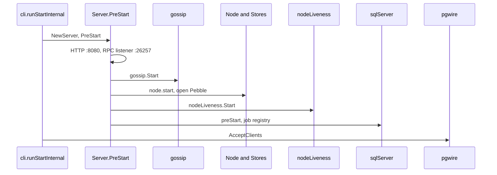

> **FGL page.** Future Gadget Laboratories wrote this for FutureGadgetDatabases.
> It is not a Cockroach Labs document.

# pkg/server and pkg/cli

`pkg/cli` is the cobra front end (`cockroach start`, `cockroach sql`, `cockroach node`, …). `pkg/server` is the process that actually runs: RPC, HTTP, the KV node, and the SQL server. `cockroach-oss` is a one-file `main` that calls `cli.Main` and blank-imports the OSS UI bundle.

```go
// pkg/cmd/cockroach-oss/main.go
func main() {
    cli.Main()
}
```

The import beside it is `pkg/ui/distoss`. The full binary's `main` (`pkg/cmd/cockroach/main.go`) instead blank-imports `pkg/ccl`, `pkg/ccl/cliccl`, and `pkg/ui/distccl`. Release builds do not use that `main`.

## Purpose

- Parse flags and start, join, or talk to a cluster (`pkg/cli`).
- Open stores, join gossip, start liveness, and only then accept SQL (`pkg/server`).
- Serve gRPC (KV `Batch`, DistSQL, status, admin) and HTTP (DB Console, health, metrics).
- Run the job scheduler after SQL is up.

## Key types and entry points

| Piece | Where | Role |
| --- | --- | --- |
| `cli.Main` | `pkg/cli/cli.go` | `doMain` → cobra `Run`. |
| `startCmd` | `pkg/cli/start.go` | `runStart` → `runStartInternal`. `start-single-node` is the one-replica variant. |
| `server.NewServer` | `pkg/server/server.go` | Builds gossip, RPC context, the KV node, liveness, the SQL server. |
| `topLevelServer.PreStart` | `pkg/server/server.go` | Listeners, cluster init, stores, gossip, liveness, SQL `preStart`. Does not accept pgwire yet. |
| `AcceptClients` | `pkg/server/server.go` | `startServeSQL` — pgwire starts here. |
| `ServerStartupInterface` | `pkg/server/serverctl/api.go` | Documents the `PreStart` / `AcceptClients` split. |
| `startListenRPCAndSQL` | `pkg/server/start_listen.go` | One port, multiplexed, unless `--split-listen-sql`. |
| `newGRPCServer` | `pkg/server/grpc_server.go` | Wraps `rpc.NewServer`. |
| `Node.start` | `pkg/server/node.go` | Opens stores, gossips the node descriptor. |
| `bootstrapCluster` | `pkg/server/node.go` | Initial KV data and splits on a brand-new cluster. |
| HTTP routes | `pkg/server/server_http.go` | `ui.Handler` at `/`. |
| Status RPCs | `pkg/server/status.go` | `serverpb.RegisterStatusServer`. |
| DB Console assets | `pkg/ui/ui.go`, `pkg/ui/distoss/distoss.go` | `HaveUI`, embedded `assets.tar.gz`. |
| Job scheduler | `pkg/server/server_sql.go` | `jobRegistry.Start` in `sqlServer.preStart`; `initJobScheduler` starts the daemon. |

Other CLI entry points worth knowing: `sql` (a client, not a server), `node status` / `node ls` / `decommission` (`pkg/cli/node.go`), `init`, `cert`, `debug` (`pkg/cli/debug.go`). `debug` has hooks (`PopulateStorageConfigHook`, `EncryptedStorePathsHook`) that stay nil without CCL, so encryption-aware debug commands are absent.

## Startup order

`runStartInternal` (`pkg/cli/start.go`) constructs the server and then, in order: `PreStart`, `AcceptInternalClients`, `RunInitialSQL`, `AcceptClients`.

`PreStart` (`pkg/server/server.go`) does roughly this:

1. Certificate signal handler, unless `--insecure`.
2. Clock-jump monitoring (`startMonitoringForwardClockJumps`).
3. HTTP listener (`startHTTPService`) — port 8080 by default, so the console can come up before SQL is ready.
4. RPC and SQL listeners via `startListenRPCAndSQL`, then gRPC-gateway routes (`/health`, admin, status, auth, timeseries).
5. Cluster init handshake (`initServer.ServeAndWait`) and version initialization.
6. `gossip.Start`.
7. `node.start` — engines, stores, node descriptor gossip.
8. gRPC moves to operational mode. `nodeLiveness.Start` (`pkg/kv/kvserver/liveness`).
9. `sqlServer.preStart` — catalog, lease manager, job registry, DistSQL server.
10. `initJobScheduler`.
11. HTTP routes, including the DB Console.

`AcceptClients` is the step that calls `startServeSQL`. A connection that arrives before that is not a SQL session yet.

On a new cluster, `bootstrapCluster` writes the initial keyspace: static splits plus the system tables (`kvserver.WriteInitialClusterData` from `pkg/server/node.go`). That is what creates meta1, meta2, liveness, and the `system` database. It runs once, on the bootstrapping node.



## Ports, HTTP, gRPC, the console

Defaults are in `pkg/base/config.go`:

| Port | Setting | What shares it |
| --- | --- | --- |
| 26257 | `DefaultPort` | pgwire and gRPC, multiplexed with `cmux`. pgwire is matched by `pgwire.Match`. gRPC takes the rest (`start_listen.go`). |
| 8080 | `DefaultHTTPPort` | DB Console, `/health`, metrics, gRPC-gateway. |

`--split-listen-sql` gives SQL its own listener (`SQLAddr`). The default lab does not need that.

The OSS UI is a tar of static files embedded by `//go:embed` in `pkg/ui/distoss/distoss.go`. `init` sets `ui.HaveUI = true` and `ui.Assets`. `http.setupRoutes` mounts `ui.Handler` at `/`. The Bazel graph is `cockroach-oss` → `//pkg/ui/distoss` → a `genrule` that packs `//pkg/ui/workspaces/db-console:db-console-oss`. There is no separate `dev ui` step in the release build. CCL-only screens are in `pkg/ui/distccl`, which this binary does not embed. The comment in [../architecture.md](../architecture.md) matches that: the open-source UI is what you get at `http://localhost:8080`.

Status data for `cockroach node status` is the status gRPC service (`pkg/server/status.go`), also exposed through the gateway for the console.

## What it depends on

- `pkg/kv/kvserver` for stores and replicas.
- `pkg/sql` for the SQL server. The blank imports in `server.go` pull in OSS job registration (`importer`, `ttljob`, `gcjob`, schema changers via `pkg/sql`).
- `pkg/gossip`, `pkg/rpc`, `pkg/security`, `pkg/settings`, `pkg/jobs`, `pkg/util/stop`.
- `pkg/ui/distoss` for the console assets. The server package calls `pkg/ui`, which reads whatever `init` installed.

`pkg/cli` depends on `pkg/server`. The `cockroach-oss` binary depends on `pkg/cli` and does not name `pkg/ccl`.

## Invariants

- External SQL starts only in `AcceptClients`. Internal work during `PreStart` uses the internal executor, not a client socket.
- One process, one or more stores. Each store is one directory and one `Engine` (see [storage.md](storage.md)).
- `--insecure` disables TLS for RPC and marks the HTTP server insecure (`base.Config.Insecure`). It is a lab flag. The operations page says the same thing.
- Node IDs and store IDs are allocated at init and stored in the store. They do not follow the hostname.

## Gotchas

- **The console being up does not mean SQL is up.** HTTP starts in `PreStart`, pgwire in `AcceptClients`.
- **`start-single-node` is a replication factor of 1**, not "a cluster that will grow." Adding nodes later does not automatically raise `num_replicas`. The zone config does.
- **Joining** (`cockroach start --join`) does not bootstrap. One node has to init the cluster (`cockroach init`, or the single-node command). Two nodes bootstrapping is how you get two clusters.
- **Clock offset is fatal on purpose.** Default max offset is 500 ms (`base.DefaultMaxClockOffset`). The flag refuses values above 5 s (`maximumMaxClockOffset` in `pkg/server/config.go`). The tolerated offset is 80% of that (`ToleratedOffset`). The check itself lives in `pkg/rpc`; see [rpc.md](rpc.md).
- **Minimum store size, when you set one,** is `10 * 64 << 20` bytes, 640 MiB (`pkg/base/store_spec.go`). An on-disk store with no `size=` has no byte cap in the spec. In-memory stores must set a size.
- **File descriptors.** `pkg/server/config.go` records a minimum of 256 network FDs and recommends 5000. A laptop that hits "too many open files" is hitting this, not Raft.
- **License enforcer.** `pkg/server/license/enforcer.go` starts disabled unless `COCKROACH_ENABLE_LICENSE_ENFORCER=true` (`getInitialIsDisabledValue`). This tree has no license key. Leave the enforcer off. The messages it would emit ("No license installed…", "License expired…") are real code, and they are not on the default path.
- **`cockroach version` prints `Distribution: OSS`** because `pkg/build/info.go` sets `Distribution = "OSS"` and nothing in this binary overwrites it. A CCL `init` hook is what changes the string in the other binary.
