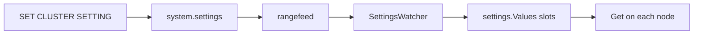

> **FGL page.** Future Gadget Laboratories wrote this for FutureGadgetDatabases.
> It is not a Cockroach Labs document.

# pkg/settings

Cluster settings are named values that every node should see: `sql.defaults.vectorize`, `kv.raft.command.max_size`, and a few hundred others. They are not command-line flags. Flags are process-local and read at start. Settings are stored in `system.settings` and propagated while the cluster is running.

`pkg/settings/doc.go` is a short version of this. The watcher that makes it live is not in `pkg/settings`.

## Purpose

- Register every setting in one process-wide registry, with a type, a default, and a slot.
- Hold the current values in a `Values` struct that readers hit without taking a lock on the system table.
- Propagate overrides: explicit setting, then any override layer, then the default.

## Key types and entry points

| Piece | Where | Role |
| --- | --- | --- |
| `registry` | `pkg/settings/registry.go` | Global map filled by `Register*` calls from `init` functions all over the tree. |
| `Values` | `pkg/settings/values.go` | Slot array. The comment says the maximum number of settings is 1023. |
| `Updater` | `pkg/settings/updater.go` | `Set`, `SetToDefault`, `ResetRemaining`. Decodes rows from `system.settings`. |
| `cluster.Settings` | `pkg/settings/cluster/cluster_settings.go` | One `Values` plus `MakeUpdater()`. |
| `SettingsWatcher` | `pkg/server/settingswatcher/settings_watcher.go` | Rangefeed on `system.settings`. Builds an updater with `settings.MakeUpdater()` and applies it. |
| SQL write | `pkg/sql/set_cluster_setting.go` | `SET CLUSTER SETTING` upserts `system.settings`. |
| Table | `pkg/sql/catalog/systemschema/system.go` | Columns `name`, `value`, `lastUpdated`, `valueType`. |

`SET CLUSTER SETTING name = value` is the user entry. The statement writes a row. The watcher on each node sees the rangefeed event and calls `Updater.Set`. Readers call `someSetting.Get(&st.SV)`.

## How data and control enter and leave

**In.** An upsert into `system.settings`, usually from `set_cluster_setting.go`. A new cluster also has code that writes defaults that must be explicit (version, cluster id). Most settings do not have a row until someone sets them. `Get` returns the registered default.

**Propagation.** `SettingsWatcher` (`pkg/server/settingswatcher`) starts with the SQL server. It watches the table's span. On each update it resets remaining slots to default and applies the rows it still sees, so a deleted row reverts. The rangefeed is the same mechanism as [kv.md](kv.md): values plus a resolved timestamp. A node that has not received the checkpoint can still be on the old value. That window is normally sub-second and is not a transaction barrier.

**Out.** Any package that captured `*cluster.Settings` at startup. The KV server, SQL executor, and storage engine all do this. There is no push into a running function. A long `IMPORT` keeps the values it read until it calls `Get` again.

## What it depends on

- `system.settings` (SQL catalog, KV underneath).
- `pkg/kv/kvclient/rangefeed` for the watch.
- `pkg/util/stop` for the watcher task.

Registration is the other direction: packages depend on `pkg/settings` and register in `init`. The OSS binary therefore only has settings whose packages it linked. A setting that exists only because `pkg/ccl` imported it will not appear in `SHOW CLUSTER SETTINGS` on `cockroach-oss`. `pkg/settings/lint/lint_test.go` even notes that it imports CCL packages so the test can see every setting. That test is not the release binary.

## Invariants

- Setting names are stable strings. `kv.raft.command.max_size` is looked up by that name in SQL and by the Go variable `kvserverbase.MaxCommandSize`.
- Slot indexes are assigned at process start, in registration order, and are not persisted. Do not write them to disk.
- `Values` readers must see a complete value. The updater swaps typed slots. A `Get` during an update does not return a torn struct. (The implementation uses atomics per slot; do not replace that with a plain store.)
- Defaults in Go are the source of truth when the table has no row. A backup of `system.settings` does not capture "the default we were compiled with."

## Gotchas

- **A flag and a setting can both exist for related ideas** and they are not the same knob. `--max-offset` is a flag (`pkg/cli/cliflags`). It is not `SET CLUSTER SETTING`. Changing the flag means a restart, and every node must agree. The `MaxOffset` comment says real skew above it can break linearizability.
- **`SHOW CLUSTER SETTING` vs the Go default.** If you never set it, the value you see is the `Register*` default. The description string is sometimes stale. `sql.defaults.use_declarative_schema_changer` is the example in [sql.md](sql.md): the text says "disables … by default" and the default argument is `"on"`.
- **Application-level vs system-level.** The first argument of `Register*` is the class (`settings.ApplicationLevel` and others). Application-level settings can differ per tenant in a multi-tenant build. This binary's usual lab is one tenant, the system tenant. Do not assume a setting you set in one virtual cluster applies to another if you ever run that configuration. Virtual clusters that need a remote KV connector are a CCL hook; see [BOUNDARIES.md](BOUNDARIES.md).
- **The 1023 cap is a compile-time slot limit** in `values.go`, not a hint. Adding settings in a fork has to stay under it. This pin is already close enough that a large new batch of settings should check `pkg/settings/values.go` before registering dozens of them.
- **Settings do not cross a process that has not started the watcher.** `cockroach sql` as a client does not watch `system.settings`. It sends SQL. The server applies the setting.
