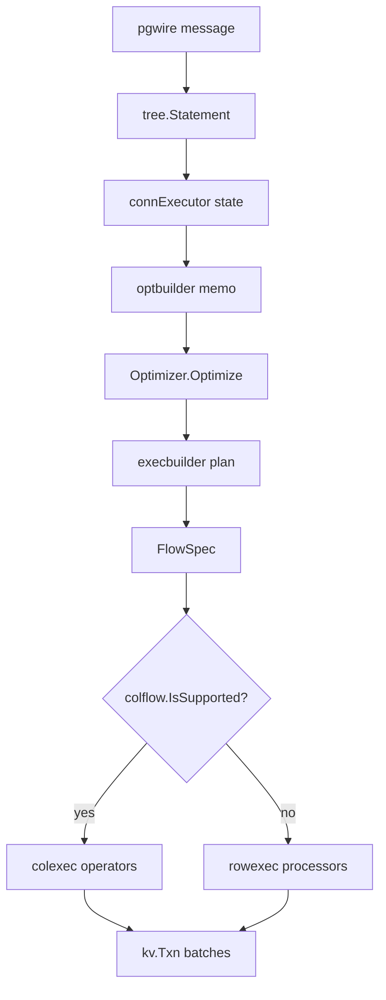

> **FGL page.** Future Gadget Laboratories wrote this for FutureGadgetDatabases.
> It is not a Cockroach Labs document.

# pkg/sql

The SQL layer is the gateway. It speaks the PostgreSQL wire protocol, turns statements into KV batches, and returns rows. It does not store bytes itself. A useful overview of the optimizer's own vocabulary is the comment in `pkg/sql/opt/doc.go`. This page is the path through the packages, with the file names you will actually open.

## Purpose

- Accept a connection and run a transaction state machine (`pgwire`, `connExecutor`).
- Parse SQL text into an AST (`parser`, `sem/tree`).
- Choose a plan (`opt`) and run it as a local or distributed flow (`physicalplan`, `flowinfra`, `rowexec`, `colflow`).
- Read and write table descriptors (`catalog`, `catalog/descs`, `catalog/lease`).
- Change schemas, either declaratively (`schemachanger`) or with descriptor mutations (`schema_changer.go`).

`pkg/sql` is large. The packages that show up on a normal `INSERT` / `SELECT` are listed below. The rest (`logictest`, `opt/testutils`, `randgen`, and so on) are tests and generators.

## Key types and entry points

| Piece | Where | Role |
| --- | --- | --- |
| `pgwire.Server` | `pkg/sql/pgwire/server.go` | `ServeConn` accepts one connection. |
| `pgwire.conn` | `pkg/sql/pgwire/conn.go` | Implements the client-comm side. `handleSimpleQuery`, `handleParse`, `handleBind`, `handleExecute`. |
| `connExecutor` | `pkg/sql/conn_executor.go`, `conn_executor_exec.go` | `run` → `execCmd` → `execStmt` → `execStmtInOpenState`. |
| Transaction states | `pkg/sql/conn_fsm.go` | `TxnStateTransitions`, `stateNoTxn`, `stateOpen`, `stateAborted`, `stateCommitWait`. |
| `parser.Parse` | `pkg/sql/parser/parse.go` | Scanner plus yacc (`sql.y`) → `statements.Statements` of `tree.Statement`. |
| `optbuilder.Builder.Build` | `pkg/sql/opt/optbuilder/builder.go` | AST → memo. Called from `optPlanningCtx.buildExecMemo` in `pkg/sql/plan_opt.go`. |
| `xform.Optimizer.Optimize` | `pkg/sql/opt/xform/optimizer.go` | Cheapest physical expression in the memo. |
| `execbuilder.Builder.Build` | `pkg/sql/opt/exec/execbuilder/builder.go` | Memo → exec plan. |
| `DistSQLPlanner` | `pkg/sql/distsql_physical_planner.go`, `pkg/sql/distsql_running.go` | `createPhysPlan`, `PlanAndRun`, `PlanAndRunAll`, `Run`. |
| `PhysicalPlan.GenerateFlowSpecs` | `pkg/sql/physicalplan/physical_plan.go` | One `FlowSpec` per participating SQL instance. |
| `colflow.IsSupported` | `pkg/sql/colflow/vectorized_flow.go` | Whether this spec can run columnar. |
| `descs.Collection` | `pkg/sql/catalog/descs/collection.go` | Per-session leased, uncommitted, and synthetic descriptors. |
| `lease.Manager` | `pkg/sql/catalog/lease/lease.go` | Descriptor leases. |
| `catalog.TableDescriptor` | `pkg/sql/catalog/descriptor.go` | Interface. Concrete types live in `pkg/sql/catalog/tabledesc`. |
| `planner.SchemaChange` | `pkg/sql/schema_change_plan_node.go` | Declarative DDL plan. `scbuild.Build` is `pkg/sql/schemachanger/scbuild/build.go`. |
| `planner.writeSchemaChange` | `pkg/sql/table.go` | Legacy mutation write and schema-change job. |
| `SchemaChanger` | `pkg/sql/schema_changer.go` | Resumer side of the legacy changer. |

Internal SQL (jobs, background work) uses `InternalExecutor` and `pkg/sql/isql` rather than a client connection. It still ends in a `kv.Txn`.

## How data and control enter and leave

**In.** Bytes on port 26257 (or a unix socket). `pgwire` decodes messages. SQL text becomes an AST before `connExecutor` sees it, except for a few internal re-parses.

**Through.** `execStmtInOpenState` updates the descriptor-lease deadline on the transaction, then `dispatchToExecutionEngine` plans and runs. Results go back through the `ClientComm` interface the pgwire `conn` implements. The executor decides when a result is finished; the conn writes the wire messages.

**Out.** KV batches on `kv.Txn`. The main read helper is `pkg/sql/row/kv_batch_fetcher.go` (`txn.Send`). Writes use the row package's inserter / updater / deleter, which also send batches. Schema changes write descriptors through `kv.Batch` in `writeSchemaChangeToBatch` (`pkg/sql/table.go`) and enqueue a job.

**DDL fork.** `buildOpaque` (`pkg/sql/opaque.go`) tries `planner.SchemaChange` for statements that implement `tree.CanModifySchema`. A `nil, nil` return means "not handled declaratively"; planning falls through to the legacy plan node. Statements that implement `tree.CCLOnlyStatement` go to `maybePlanHook`. If no hook claims them, the error is `a CCL binary is required to use this statement type: %T` (SQLSTATE `XXC01` via `pgcode.CCLRequired`).

## What it depends on

- `pkg/kv` for `DB` and `Txn`. SQL does not import `pkg/kv/kvserver` on the request path.
- `pkg/jobs` for schema changes, statistics, TTL, and import.
- `pkg/settings` and `pkg/settings/cluster` for `sql.defaults.*`.
- `pkg/sql/catalog/...` for descriptors. The catalog reads KV through `catkv`.
- `pkg/roachpb` and `pkg/kv/kvpb` for request types.
- `pkg/util/hlc` for the transaction timestamp.

The server wires the SQL instance in `pkg/server/server_sql.go` (`sqlServer.preStart`). `pkg/server/server.go` blank-imports `pkg/sql/importer`, `pkg/sql/ttl/ttljob`, and `pkg/sql/gcjob` so their `init` functions register plan hooks and job resumers. Those packages are OSS and are linked into `cockroach-oss`.

## Invariants

- One `connExecutor` per connection. Statements on that connection are ordered by the `StmtBuf`.
- Inside a SQL transaction, use the transaction context (`txnState.Ctx`), not only the connection context. The state-machine comment in `conn_fsm.go` says this.
- A leased descriptor must stay valid for the transaction's read timestamp. The executor bumps the deadline before execution.
- `Optimizer.Optimize` is once per memo.
- Query errors are reported on the `CommandResult`. `execStmt` returning nil does not mean the query succeeded.
- The declarative changer and the legacy changer must not both own the same table. `writeSchemaChange` returns an error if a declarative change is in progress (`pkg/sql/table.go`).

## Gotchas

- **Parsing is usually not inside `execStmt`.** If you set a breakpoint only in `conn_executor_exec.go`, you will miss the AST. Look at `pkg/sql/pgwire/conn.go` first.
- **`stateNoTxn` does not run the statement.** `execStmtInNoTxnState` starts a transaction and the same statement runs again in `stateOpen`. A trace that shows the statement twice is normal.
- **Autocommit and multi-statement simple queries.** A simple-query message can hold several statements. The executor treats the last one with the same "implicit autocommit" rules Postgres uses. The comment is on `execCmd` in `conn_executor.go`.
- **Extended protocol after an error.** pgwire ignores messages until `Sync`. That is `serveImpl` in `pkg/sql/pgwire/server.go`.
- **Vectorized is the default, not a special mode.** `sql.defaults.vectorize` is `on`. Unsupported processors silently use `rowexec` unless the session is `experimental_always`.
- **DistSQL "auto" is not "always remote".** `sql.defaults.distsql` is `auto`. `PlanAndRun` can also retry a distributed plan as local when the distributed attempt fails before any rows are returned (`distsql_running.go`).
- **Experimental DistSQL planning is off.** `sql.defaults.experimental_distsql_planning` defaults to `off`, so the spec-exec factory (`newDistSQLSpecExecFactory` in `plan_opt.go`) is not the default. The default still builds plan nodes and then a physical plan.
- **Declarative schema changer default disagrees with its comment.** `sql.defaults.use_declarative_schema_changer` is registered with default `"on"` in `pkg/sql/exec_util.go`, while the setting description string says it "disables new schema changer by default". The session-data comment says mode `on` uses the declarative changer for supported statements in implicit transactions. The code agrees: `planner.SchemaChange` returns `nil, nil` when `TxnIsSingleStmt` is false (`pkg/sql/schema_change_plan_node.go`). That flag is set only when the statement can auto-commit and it is the first statement (`conn_executor_exec.go`), so an explicit `BEGIN` falls back even if it contains one statement. Unsupported statements also return `nil, nil` unless the mode is `unsafe_always`.
- **`COPY` is simple-protocol only.** `handleParse` rejects extended-protocol `COPY FROM`.
- **CCL statements look like parse errors only after planning.** The parser accepts `BACKUP`, `IMPORT`, and the rest. The gate is `opaque.go` or a hook the statement calls. `IMPORT` has an OSS plan hook (`pkg/sql/importer/import_planning.go`). `BACKUP` does not. Details are in [BOUNDARIES.md](BOUNDARIES.md).
