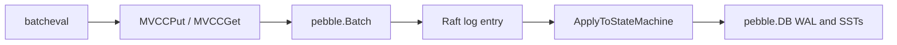

> **FGL page.** Future Gadget Laboratories wrote this for FutureGadgetDatabases.
> It is not a Cockroach Labs document.

# pkg/storage

`pkg/storage` is the on-disk key/value engine and the MVCC layer on top of it. In this tree the engine is Pebble. `docs/design.md` still says RocksDB. That sentence is historical. There is no RocksDB store in this pin.

## Purpose

- Open a Pebble database for a store directory and expose it as an `Engine`.
- Encode MVCC keys (user key + timestamp) and implement `Get` / `Put` / `Scan` / intent handling on top of that engine.
- Optionally wrap the filesystem for encryption at rest. The wrapper function is a hook. On `cockroach-oss` the hook is nil. See [BOUNDARIES.md](BOUNDARIES.md).

KV server code calls this package. SQL does not open Pebble itself.

## Key types and entry points

| Piece | Where | Role |
| --- | --- | --- |
| `Engine` | `pkg/storage/engine.go` | Reader, writer, batches, snapshots, ingest. `Pebble` implements it (`var _ Engine = &Pebble{}` in `pebble.go`). |
| `Pebble` | `pkg/storage/pebble.go` | Wraps `*pebble.DB`. |
| `Open` | `pkg/storage/open.go` | Sets `DefaultPebbleOptions` and calls `NewPebble`. |
| `NewPebble` | `pkg/storage/pebble.go` | Calls `pebble.Open`. Requires `cfg.Settings`. |
| `DefaultPebbleOptions` | `pkg/storage/pebble.go` | Comparer `EngineComparer`, merger `MVCCMerger`, 64 MiB memtable, 32 KiB data blocks, 256 KiB index blocks. |
| `MVCCKey` | `pkg/storage/mvcc_key.go` | `Key roachpb.Key` plus `hlc.Timestamp`. An empty timestamp is a metadata key. |
| `MVCCGet`, `MVCCPut` | `pkg/storage/mvcc.go` | The calls `batcheval` uses. |
| `MVCCGetProto` / `MVCCPutProto` | `pkg/storage/mvcc.go` | Used while the store is opening system keys. |
| `ResolveEncryptedEnvOptions` | `pkg/storage/pebble.go` | Encryption hook. `NewEncryptedEnvFunc` is nil in this binary. |
| Package comment | `pkg/storage/doc.go` | The intent / metadata model in prose. |

`Store.TODOEngine()` (`pkg/kv/kvserver/store.go`) is what replica evaluation uses today. `StateEngine()` and `LogEngine()` exist for a split between state and the Raft log. The comment on `TODOEngine` says the split is not finished. Treat `TODOEngine()` as "the engine the replica actually writes."

## How data and control enter and leave

**In.** `kvserver` opens the engine at store start (`storage.Open`). During a request, `replica_evaluate.go` passes a `storage.ReadWriter` into evaluation. Writes use `r.store.TODOEngine().NewBatch()` (`pkg/kv/kvserver/replica_write.go`). Reads use `NewReadOnly` (`pkg/kv/kvserver/replica_read.go`).

**MVCC shape.** From `pkg/storage/doc.go` and `mvcc_key.go`:

- Versions of a user key are stored newest-first. The encoded suffix is the wall time (8 bytes, big-endian) and the logical time (4 bytes).
- A metadata key (no timestamp suffix) holds `enginepb.MVCCMetadata`: the latest timestamp and, when the latest write is uncommitted, the `roachpb.Transaction`. That metadata record is the intent marker.
- `MVCCGet` returns the newest value at or below the read timestamp. If it meets another transaction's intent above that timestamp, it returns a `LockConflictError` and sets `Intent` on the result (`mvcc.go`).
- `MVCCPut` with an empty timestamp is an inline, non-versioned write (used for a few internal keys). Transactional puts go through the lock table.

**Out.** The evaluated batch is what Raft replicates. Apply commits it (`b.batch.Commit` on the Pebble batch inside `replicaAppBatch.ApplyToStateMachine`). After that, a later `MVCCGet` on any replica that has applied the entry sees the value.

Pebble's own compaction and WAL are below this. A Cockroach "commit" means the Pebble batch commit returned, which syncs according to the durability the batch asked for. It does not mean every range replica has applied it. That is Raft's job.

## What it depends on

- `github.com/cockroachdb/pebble` (the library, not a `pkg/` directory).
- `pkg/roachpb` for keys, values, and transaction records inside intents.
- `pkg/util/hlc` for `Timestamp`.
- `pkg/storage/enginepb` for `MVCCMetadata`.
- Cluster settings such as `storage.max_sync_duration` and `storage.value_blocks.enabled`, registered in `pebble.go`.

Encryption, if it were linked, would wrap the `vfs.FS` before `pebble.Open`. `ResolveEncryptedEnvOptions` returns the error `encryption is enabled but no function to create the encrypted env` when `NewEncryptedEnvFunc` is nil.

## Invariants

- MVCC keys for one user key sort in **descending** timestamp order (`mvcc_key.go`). A forward scan of the engine sees the newest version first.
- A read at timestamp T never returns a value written at T' > T, except that an intent in the way is a conflict, not a silent skip.
- Intent metadata and the provisional value are the same logical write. Crashing between them is the apply path's problem: Raft applies the whole batch.
- The comparer and merger (`EngineComparer`, `MVCCMerger`) must match what was used to write the store. You cannot point a newer experimental comparer at a v23.2.15 directory and expect it to open.

## Gotchas

- **GC is not Pebble compaction.** Old MVCC versions are removed by the MVCC GC queue using the zone `gc.ttlseconds`. The default in `DefaultZoneConfig` is 4 hours (`TTLSeconds: 4 * 60 * 60`). Compaction only rewrites SSTs. A `SELECT` with a very old `AS OF SYSTEM TIME` fails once GC has passed that timestamp.
- **32 KiB blocks are a default, not a tuning you get from SQL.** `BlockSize = 32 << 10` is inside `DefaultPebbleOptions`. Changing it is an engine option, not a cluster setting.
- **`TODOEngine` is the live engine.** Code that opens `StateEngine()` or `LogEngine()` and expects the SQL data will not find it on this pin.
- **A store directory is the replica's identity.** Deleting it and starting again does not "rejoin" the old replica. The remaining replicas have to up-replicate, and only if they still have a majority. [../architecture.md](../architecture.md) walks through that for a lab.
- **Encryption flags without a CCL hook fail at open**, not at the first write. Two strings in `ResolveEncryptedEnvOptions`: the nil-hook error above, and `encryption was used on this store before, but no encryption flags specified. You need a CCL build and must fully specify the --enterprise-encryption flag` when a file registry is present but encryption flags are not.
- **Shared storage** (`ConfigureForSharedStorage`) is also a nil hook in this binary: `shared storage requires CCL features` (`pebble.go`).
